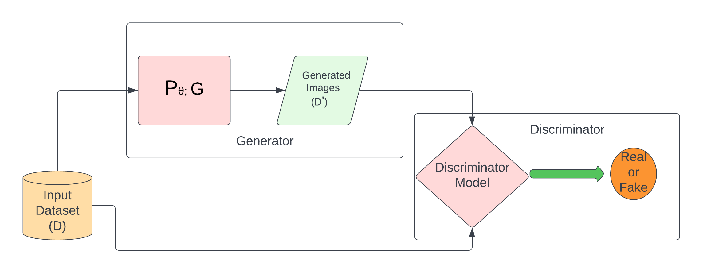
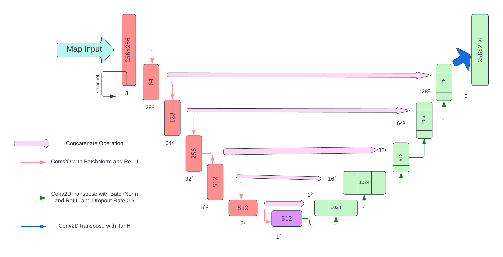
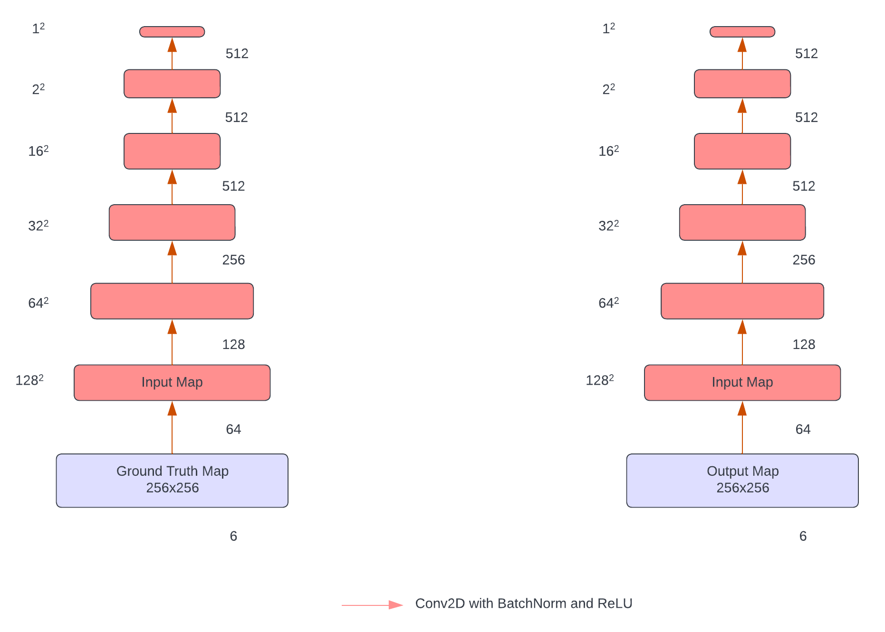
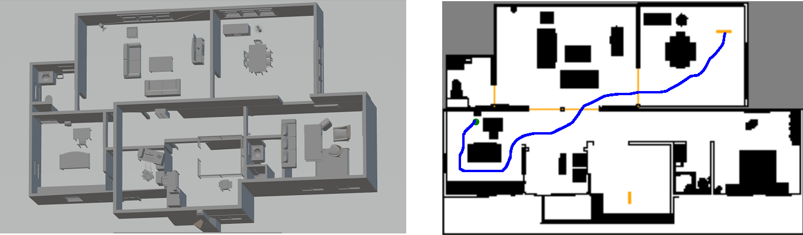

Footstep Planning of the Humanoid Robots using Generative Adversarial Network (GAN)
================================
Inspired by the successful application of GANs in producing artificial images, we apply this technique to generate paths between two points that can be used in Footstep Planning of the Humanoid Robots. 
The implementation of GAN is adopted from [Keras-GAN](https://github.com/eriklindernoren/Keras-GAN). 

The code is the GAN implementation of our paper [Footstep planning of humanoid robot in ROS environment using Generative Adversarial Networks (GANs) deep learning](https://doi.org/10.1016/j.robot.2022.104269)

## Here is the architecture of the proposed model: 

 

### Path Images are Generated via Encoder Architecture.

### Correct Path is classified by Decoder Architecture.

Requirements:
---------------

- numpy
- pandas
- keras
- sklearn
- tensorflow

## One of the sample generated path in office enviornment:

Citation:
-----------
Please cite our work when using our software or dataset in your own research or publication.
* Pradumn Mishra, Urja Jain, Siddharth Choudhury, Surjeet Singh, Anish Pandey, Abhishek Sharma, Ramanpreet Singh, Vimal Kumar Pathak, Kuldeep K. Saxena, Anita Gehlot,
Footstep planning of humanoid robot in ROS environment using Generative Adversarial Networks (GANs) deep learning,
Robotics and Autonomous Systems,
Volume 158,
2022,
104269,
ISSN 0921-8890,
https://doi.org/10.1016/j.robot.2022.104269..

 

